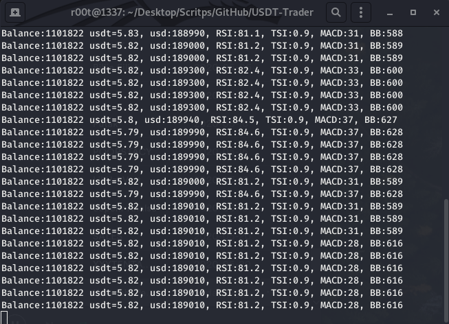
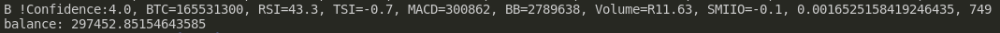
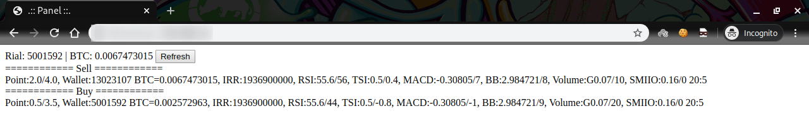

# BTC-Trader
An Automated-Bot for Trading BTC-IRR
##### Here is the [USDT-version](../../tree/8a3710a16ada218aeb913ec9d61538ca65190a5e)
# How it works ?
- Long story short, it will buy **Low** and sell **High**.
- Real-time analyzing
- 6 indicators are used to **improve** results
- Sample ScreenShot:
- 
# Current Results
### Please note that, this is not the FINAL version
`2.97x` Profit since January 1st 2020
 
 
So as you can see, It started with **100,000 IRR** and ended up to **297,452 IRR** (7th Test)

# Web Panel
The WebPanel for **Monitoring** (Apache2 Service)

### Current features
- Current Balance
- Latest Sell & Buy log
- Latest Activity
- Sell/Buy process is down
 
Sample ScreenShot:

# Disclaimer
The **AUTHOR** and This repository and the information contained herein is not intended to be a source of advice or credit analysis with respect to the material presented, and the information and/or documents contained in this website do not constitute investment advice. So the Auther is NOT RESPONSIBLE !
# ToDo List
- [ ] Profit Goal: 3.5x
- [ ] Test & Run Day-trade Mode
