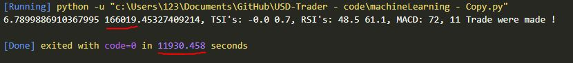

# USDT-Trader
An Automated-Bot for Trading USD

# How it works ?
Long story short, it will buy **Low** and sell **High**.

# Current Results
### Please note that this is not the FINAL version
`1.47x` Profit since January 2020
 
 
So as you can see, I started with **100,000IRR** and it ended up to **166,000IRR** (3rd Test)

# ToDo List
- [ ] Finish coding main.py
- [ ] Profit Goal: 100%
- [X] Get current USDT value
- [X] Work with more `indicators`
- [ ] Maybe add GUI
