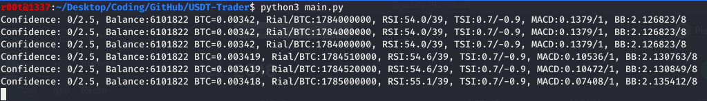

# USDT-Trader
An Automated-Bot for Trading USDT-IRR
# How it works ?
- Long story short, it will buy **Low** and sell **High**.
- Real-time analyzing
- 4 indicators are used to **improve** results
- Sample ScreenShot:
- 
# Current Results
### Please note that this is not the FINAL version
`1.72x` Profit since January 1st 2020
 
 
So as you can see, It started with **100,000IRR** and ended up to **172,132IRR** (5th Test)

# Disclaimer
The **AUTHOR** and This repository and the information contained herein is not intended to be a source of advice or credit analysis with respect to the material presented, and the information and/or documents contained in this website do not constitute investment advice. So the Auther is NOT RESPONSIBLE !
# ToDo List
- [ ] Finish coding main.py
- [ ] Profit Goal: 2x
- [ ] Run/test in BTC
- [X] Get current Stats
- [X] Work with 4 or more `indicators`
- [ ] Maybe add GUI
